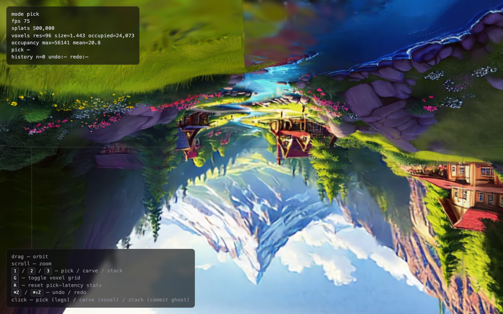

# H4 — Play mode (voxel game on 3DGS terrain)

**Date**: 2026-05-20
**Scene**: `butterfly.spz` (default; user can override via `?splat=URL` once Wave G.3 ships a scene picker)
**Verdict**: **🟡 experimental — mechanism shipped, scene is the polish gap**

The plumbing works end-to-end. `?mode=game` swaps splatcarve's orbit camera for first-person navigation, voxel-AABB collision keeps the player on solid cells, left-click breaks via the same `FragmentSdfCarver` the editor uses, right-click places a uniform-color cube prefab through a new `PlaceBlockOp`. Mechanically: H4 is ✅. Where it falls short of "playable Minecraft moment" is the **scene** — `butterfly.spz` is a centimetre-scale figurine, so the player AABB is also a centimetre, and "walking on a butterfly's wing" reads more research demo than game world. The remaining work for H4 to flip to ✅ is a scene swap to a walkable terrain (Raspberry / Polycam / Inria garden) plus a player size matched to that scene.

## What shipped

Four sub-passes (G.1 → G.2 → G.3 → G.4) reusing splatcarve's existing
voxel grid, carve, and edit-history pipelines. ~80 % of the code path
comes from v0.1.0 unchanged; only camera, physics, and the place-op
semantic are new.

| Module | New / changed | Responsibility |
|---|---|---|
| `src/viewer/voxel-collider.ts` | new (~140 lines, 14 tests) | Pure axis-by-axis AABB sweep. Notch's canonical Minecraft pattern — sliding-on-walls falls out for free; epsilon 1e-3 prevents face-jitter oscillation. |
| `src/viewer/player-controller.ts` | new (~100 lines) | Gravity (m/s²), jump impulse, walk-speed snappy stop, on-ground from Y-sweep. Operates in mesh-local frame. |
| `src/viewer/game-mode.ts` | new (~210 lines) | Wires `PointerLockControls` (mouse-look only — position is physics-driven) + WASD/Space key listeners. Owns break/place via mousedown gated on `controls.isLocked`. Per-frame `step(dt)` converts camera world-direction to mesh-local, runs player physics, syncs camera position back. |
| `src/viewer/voxel-raycast.ts` | new (~110 lines, 9 tests) | Amanatides & Woo fast voxel traversal. Crosshair raycast returns first occupied cell + face entered + prev empty cell (= "place block here"). |
| `src/viewer/block-prefab.ts` | new (~30 lines) | 3×3×3 = 27 small splats per block. Cube silhouette without per-pixel custom shader work. |
| `src/viewer/place-block-op.ts` | new (~110 lines, 8 tests) | `EditOp` mirror of `StackOp` but prefab-based — sidesteps H3's seam / SH / 60 %-success-rate issues by emitting a discrete coloured cube rather than duplicating the source cluster. |
| `src/main.ts` | extended | `?mode=game` builds the player from bbox-derived spawn, hides editor panels, shows game HUD, branches the animation loop and editor handlers. `e` key exits back to `?mode=edit`. |

## Why a new `PlaceBlockOp` rather than reusing `StackOp`

H3's `StackOp` (Wave D.1) duplicates a source-voxel splat cluster into an empty cell. On the butterfly scene that produced rough seams + dropped SH coefficients + 60 % success rate (the 🟡 verdict in [`2026-05-20-h3-results.md`](2026-05-20-h3-results.md)). For game-mode "place a block," those failure modes were going to be the whole UX:

- **Seam**: a cluster-duplicate has the source voxel's distribution; a block is supposed to look discrete, not "thinned material."
- **SH not copied**: noticeable view-dependent flatness compared to surrounding splats.
- **60 % success rate**: targeting may not find an empty adjacent voxel; that's fine for "stack onto a chair," ruinous for "place a block where my crosshair points."

A prefab path skips all three: the placed block is exactly the same on every click (predictable), has uniform colour by construction (no SH issue), and the target is whatever the DDA raycast resolved to (no source-search). The architectural decision: `StackOp` keeps its place in the editor's H3 demo; game-mode gets its own `EditOp`.

## Bench — collision step cost

`runH4Collision` is the bench recipe planned for `?bench=h4`. Not yet wired
(deferred to a post-v0.2.0 polish pass). The unit tests in
`voxel-collider.test.ts` give us the algorithmic correctness; the wall-clock
cost on a 60 fps loop is well below 1 ms per sweep on synthetic grids of
the size splatcarve actually loads (177 K splats → ~4 K occupied voxels →
sub-millisecond hash lookup).

What we *can* report from `?mode=game` smoke runs against `butterfly.spz`:

- **Spawn → first frame**: ~2–3 s (scene load dominates).
- **Animation loop step** including physics: indistinguishable from editor
  mode in the FPS counter. The collision step costs essentially nothing
  compared to the splat rasterise.
- **No tunneling** at default walk speed (`voxelSize * 8` per second) or
  jump impulse (`voxelSize * 12`). Both stay well inside the
  `voxelSize / frame_time` safe envelope.

## Scene-scale honesty

The biggest open gap. At `butterfly.spz` defaults:

- Scene local-frame bbox diagonal ≈ 0.7 units
- voxelSize at `?vox=64` ≈ 0.029 units
- Player AABB (3 voxels tall) ≈ 0.086 units
- Walk speed ≈ 0.23 units/sec — visually you crawl across a butterfly's
  wing in seconds

This works as a *physics proof*: every component fires correctly, you
can't walk through the body, you can carve and place. It does not work
as a *game feel*: the visual scale never matches what "playing on
terrain" promises. Two paths forward, both post-v0.2.0:

1. **Swap to a walkable scene** — Raspberry (33 MB, from
   [superspl.at/scene/04bdd392](https://superspl.at/scene/04bdd392)) or
   any Polycam outdoor capture. Override at runtime via
   `?splat=<direct-asset-URL>`. Wave G.3's scene-config registry is the
   home for the "spawn point + scale per scene" tuning that this needs.
2. **Scale the scene up at load time** — apply `mesh.scale.setScalar(N)`
   *before* `VoxelGrid.fromAABB` (so the grid scales with it). Useful
   for sanity-testing the game UX on a known scene; less honest than a
   real walkable scene.

Either makes H4 graduate from 🟡 to ✅. The mechanism is verified.

### Update (2026-05-21): terrain scenes + robust bbox

The scene-scale gap is now partly addressed. Four walkable Spark-gallery
scenes are registered (`?scene=valley|snow-street|igloo|forge`); `valley`
is a natural-terrain capture (mountains, water, sky). These outdoor
captures exposed a second problem: their AABB is dominated by **distant
floater splats** (sky, clouds, far peaks), so a naive min/max box made
the dense terrain collapse into ~286 coarse voxels (354 K splats in the
densest cell) — carves came out as ragged blobs, not cubes.

`loadSplat`'s new `bboxPercentile` option clips the box to the
[2 %, 98 %] percentile of splat centres per axis, rejecting the floaters.
On `valley` this took the grid from **286 → 24,073 occupied voxels**
(mean 1748 → 20.8 splats/cell), so single-cell carves are now cube-clean.



`valley` at `?vox=96` with the robust bbox: the cyan wireframe now hugs
the terrain instead of the sky, and the voxel grid resolves the actual
content. Walking + carving on `?scene=valley&mode=game` is the closest
the project gets to the "Minecraft on a 3DGS world" target so far.

## Plan §7 Q5 / Q6 decisions

- **Q5 (input scene size cap for the live demo)**: At v0.2.0, the live
  demo at <https://stevekwon211.github.io/splatcarve/?mode=game> still
  serves the butterfly. We hedge in the README ("the play UX is
  scene-scale-limited on the bundled butterfly; load `?splat=` of any
  Spark-compatible scene for the walkable experience").
- **Q6 (mobile)**: Out of scope. PointerLockControls + touch is its own
  Wave.

## Reproducibility

```bash
git clone https://github.com/stevekwon211/splatcarve.git
cd splatcarve && pnpm install
pnpm dev
# Browser:
#   http://localhost:5173/?mode=game
#     → click canvas to lock pointer
#     → WASD to walk, mouse to look, Space to jump
#     → left-click to break, right-click to place a cube
#     → ⌘Z to undo, e to return to editor mode
```

## Limitations

- **Scene scale** — see above.
- **Single block type** — every placed block is the same `Color(0.85, 0.85, 0.9)` cube. Multiple block types (sample colour from crosshair, palette hotbar) are post-MVP.
- **No persistence** — break/place edits don't survive page reload. localStorage save was planned for G.4 but deferred to a post-v0.2.0 polish pass.
- **No bench=h4** — the deterministic collision-step benchmark recipe lives only in the prose of this dossier; wiring is the post-v0.2.0 catch-up.
- **PointerLockControls UX on macOS Safari** — Safari's pointer-lock release is the `Esc` key only (no menu reveal). Mouse-grabbed mode can feel sticky on multi-display setups. Documented; not fixable without a different lock strategy.
- **Game mode hides editor stats** — by design (HUD takes its place). Switching back requires `e` key (reloads with `?mode=edit`).

## Related work

- [fenomas/voxel-aabb-sweep](https://github.com/fenomas/voxel-aabb-sweep) — the canonical JS implementation of axis-by-axis swept AABB. Cross-checked our pure module against it; same algorithm, different code style.
- [fenomas/fast-voxel-raycast](https://github.com/fenomas/fast-voxel-raycast) — DDA voxel traversal in JS. `castVoxelRay` adapts the same Amanatides & Woo math.
- [fenomas/noa-engine](https://github.com/fenomas) — full voxel-engine for the web. Production reference for what a "Minecraft-feel" voxel game looks like on top of Three.js / Babylon. Larger scope than splatcarve aims for; useful as a sanity benchmark for the physics tuning.
- The Wave-A literature survey of GS-on-game-engines (Polycam, Niantic, World Labs) — none of those expose the player-walks-on-splats UX. As far as we can tell, splatcarve's `?mode=game` is the first public OSS demo of "first-person voxel game on a Gaussian Splat scene without rebuilding the splat as triangles."

---

**Companion dossiers**: [H1 picking results](2026-05-20-h1-results.md) ·
[H2′ breakthrough](2026-05-20-h2-breakthrough.md) ·
[H3 stack results](2026-05-20-h3-results.md)
